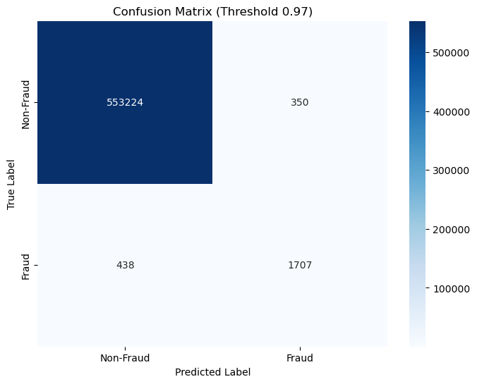
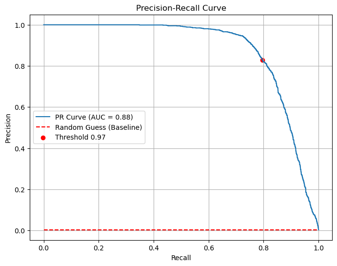
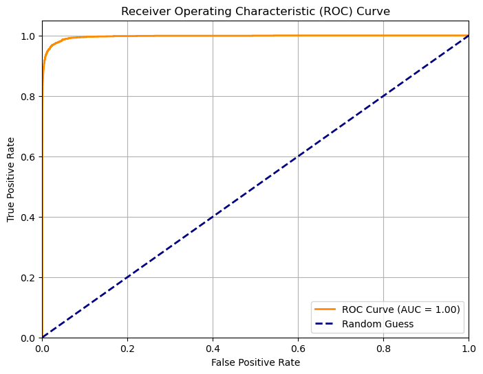
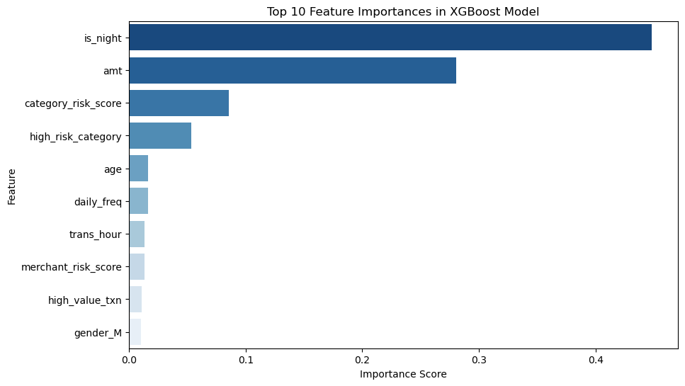

# 🔍 Credit Card Fraud Detection with Machine Learning

> **Unmasking fraud in millions of transactions using Python, PostgreSQL, and XGBoost**

[](https://www.python.org/)
[](https://www.postgresql.org/)

---

## 📊 Project Overview

This project develops an end-to-end fraud detection system that analyzes **1,852,394 credit card transactions** using advanced machine learning and SQL database management. 

**Key Achievement:** Built an XGBoost classifier achieving **0.83 precision** and **0.80 recall** at an optimized threshold, with demonstrated **$530.66 fraud prevention value** vs **$75 implementation cost**.

---

## 🎯 Business Impact

- **Scale:** Processed 1.85M+ transactions across 10 Jupyter notebooks
- **Performance:** 0.83 precision, 0.80 recall (optimized for cost-effectiveness)
- **ROI:** Cost-benefit analysis showing 7:1 fraud prevention ratio
- **Database:** 50+ SQL queries for data extraction and transformation
- **Features:** Engineered 22 custom features from raw transaction data

## 📈 Model Performance

### Confusion Matrix
  
*Model performance at 0.97 threshold: 1,707 frauds correctly detected with only 438 false negatives*

### Precision-Recall Curve
  
*Optimal balance achieved at 0.97 threshold with AUC = 0.88*

### ROC Curve
  
*Excellent model discrimination with ROC-AUC = 0.9967 on test set, demonstrating near-perfect separation between fraud and legitimate transactions*

### Feature Importance
  
*Nighttime transactions (is_night) and transaction amount (amt) are the strongest fraud predictors*

---

## 🛠️ Technical Stack

**Languages & Libraries:**
- **Python 3.11+**: Core programming language
- **Pandas & NumPy**: Data manipulation and numerical computing
- **Scikit-learn**: Machine learning and preprocessing
- **XGBoost**: Gradient boosting for classification
- **Matplotlib & Seaborn**: Data visualization
- **PostgreSQL**: Relational database management
- **SMOTE**: Handling imbalanced datasets

**Tools:**
- Jupyter Notebooks for interactive analysis
- Git & GitHub for version control

---

## 📁 Project Structure
```
├── data/
│   ├── fraudTrain.csv           # Raw training data
│   └── fraudTest.csv            # Raw test data
├── engineered_data/
│   ├── fraudTrain_engineered.csv
│   └── fraudTest_engineered.csv
├── visualizations/
│   └── (visualization files)
├── understanding_data.ipynb                # 1. Initial data exploration
├── import_data.py                          # 2. PostgreSQL database import
├── feature_engineering.ipynb               # 3. Creating 22 custom features
├── data_validation.ipynb                   # 4. Ensuring data integrity
├── md1_random_forest.ipynb                 # 5. Baseline model
├── md2_random_forest_class_weights.ipynb   # 6. Addressing class imbalance
├── md3_random_forest_smote.ipynb           # 7. SMOTE resampling
├── md4_xgboost.ipynb                       # 8. XGBoost implementation
├── md5_xgboost_with_hyperparametertuning.ipynb  # 9. Final optimized model
└── md6_lightgbm.ipynb                      # 10. Alternative model comparison
```

---

## 🚀 Key Features

### 1. **Data Exploration** ([understanding_data.ipynb](understanding_data.ipynb))
- Analyzed 1.85M transactions with severe class imbalance (0.39% fraud rate)
- Investigated patterns across time, geography, and transaction types
- Prepared data with datetime conversions and quality checks

### 2. **Database Integration** ([import_data.py](import_data.py))
- Imported data into PostgreSQL for structured querying
- Executed 50+ SQL queries for data extraction and insights
- Built scalable data pipeline for modeling

### 3. **Feature Engineering** ([feature_engineering.ipynb](feature_engineering.ipynb))
Created **22 engineered features** including:
- **Geospatial:** Transaction distance calculations (km)
- **Temporal:** Hour, day, month, night/weekend flags
- **Risk Scores:** Category, merchant, and city risk indicators
- **Behavioral:** Daily transaction frequency, age-based patterns
- **Value-based:** High-value transaction flags

### 4. **Model Development & Optimization**
Tested **6 different approaches**:
1. **Random Forest** (Baseline): 0.95 precision, 0.71 recall
2. **RF + Class Weights**: Improved recall to 0.76
3. **RF + SMOTE**: Further improved recall to 0.79
4. **XGBoost**: 0.83 precision, 0.78 recall
5. **XGBoost + Hyperparameter Tuning**: **0.83 precision, 0.80 recall** ✅
6. **LightGBM**: 0.90 recall but only 0.14 precision

### 5. **Cost-Benefit Analysis**
- Average fraud loss: **$530.66**
- Investigation cost per alert: **$75**
- Optimized threshold (0.97) balances detection accuracy with operational costs

---

## 📊 Results Summary

| Metric | Value |
|--------|-------|
| **Precision** | 0.83 |
| **Recall** | 0.80 |
| **F1-Score** | 0.81 |
| **ROC-AUC** | 0.9967 |
| **Threshold** | 0.97 |
| **True Positives** | 1,707 |
| **False Negatives** | 438 |
| **Cost Ratio** | 7:1 (fraud prevented vs investigation cost) |

---

## 💡 Key Insights

1. **Nighttime transactions** (`is_night`) are the strongest fraud predictor
2. **Transaction amount** (`amt`) is the second most important feature
3. **Engineered risk scores** (category, merchant) significantly improve detection
4. **Threshold optimization** is critical for balancing precision and recall in fraud detection
5. **Class imbalance** requires careful handling (SMOTE, class weights, `scale_pos_weight`)

---

## 🏃 Getting Started

### Prerequisites
```bash
Python 3.11+
PostgreSQL (optional, for full database integration)
```

### Installation
```bash
# Clone the repository
git clone https://github.com/Skiz1945/Credit_Card_Transaction_Fraud_Detection.git
cd Credit_Card_Transaction_Fraud_Detection

# Install dependencies
pip install -r requirements.txt
```

### Data Setup
1. Download datasets:
   - [fraudTrain.csv](https://www.kaggle.com/datasets/kartik2112/fraud-detection)
   - [fraudTest.csv](https://www.kaggle.com/datasets/kartik2112/fraud-detection)
2. Place in `/data` folder
3. Engineered datasets will be generated in `/engineered_data`

### Run Analysis
Open notebooks in Jupyter:
```bash
jupyter notebook
```

Start with:
1. `understanding_data.ipynb` - Data exploration
2. `feature_engineering.ipynb` - Feature creation
3. `md5_xgboost_with_hyperparametertuning.ipynb` - Final optimized model

---

## 🧠 What I Learned

- **Handling Imbalanced Data:** Mastered SMOTE, class weights, and `scale_pos_weight` techniques
- **Feature Engineering:** Created diverse features (geospatial, temporal, behavioral) that significantly impact model performance
- **Model Optimization:** Learned importance of threshold tuning and cost-benefit analysis in real-world applications
- **SQL Integration:** Built scalable data pipelines using PostgreSQL
- **Production Thinking:** Balanced model accuracy with operational costs for business viability

---

## 🔮 Future Enhancements

- [ ] Real-time fraud detection pipeline
- [ ] Ensemble methods combining multiple models
- [ ] Additional features from merchant and customer behavior patterns
- [ ] API deployment for production use
- [ ] A/B testing framework for threshold optimization

---

## 📬 Contact

**Milan Djokic**  
📧 Email: milandjkc1ds@gmail.com  
💼 LinkedIn: [milan-djkc-1ds](https://linkedin.com/in/milan-djkc-1ds)  
🐙 GitHub: [@Skiz1945](https://github.com/Skiz1945)

---

## 🙏 Acknowledgments

- Dataset: [Kaggle - Credit Card Fraud Detection](https://www.kaggle.com/datasets/kartik2112/fraud-detection)
- Inspiration: Real-world fraud prevention challenges in financial services

---

⭐ **If you found this project helpful, please consider giving it a star!**